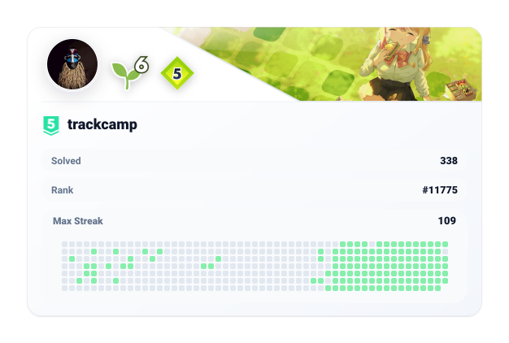

  <pre>
     _   _    _   _  ____       _ _   _ _   _   _   ___        ___    _   _ 
    | | / \  | \ | |/ ___|     | | | | | \ | | | | | \ \      / / \  | \ | |
 _  | |/ _ \ |  \| | |  _   _  | | | | |  \| | | |_| |\ \ /\ / / _ \ |  \| |
| |_| / ___ \| |\  | |_| | | |_| | |_| | |\  | |  _  | \ V  V / ___ \| |\  |
 \___/_/   \_\_| \_|\____|  \___/ \___/|_| \_| |_| |_|  \_/\_/_/   \_\_| \_|
  </pre>

  

---

  

---

### digem `2025.05 ~`

#### 해외 음악 웹진의 칼럼을 자동 수집하고 AI로 번역해 아카이빙하는 서버리스 ETL 서비스

Airflow와 GitHub Actions로 수집 파이프라인 자동화, 다중 소스 스크래퍼 공통 구조화, SQL 쿼리 최적화

        

[Site](https://www.dig-em.com/) [Repo](https://github.com/prgmd/digem)

---

### NEVES `2025.10 ~ 2025.12`

#### 대용량 블랙박스 영상을 클라우드에 실시간으로 적재하고 재생하는 MSA 서비스

사용자, 재생, 메일 서비스 분리, Terraform으로 AWS 인프라 코드화, Helm으로 쿠버네티스 배포 구성

         

[Repo](https://github.com/LuckyThreeSeven/WebApp)

---

### beautalk `2026.05 ~ 2026.06`

#### 피부 프로필을 기반으로 화장품을 추천하는 하이브리드 RAG 챗봇 서비스

백엔드 개발, 하이브리드 RAG 검색 구현

        

[Repo](https://github.com/prgmd/beautalk)

---

### 이음길 `2026.07 ~ 2026.08`

#### 여행 일정을 조각으로 이어 붙이며 팀이 하나의 보드에서 함께 계획을 완성하는 실시간 협업 플랫폼

Spring Security 기반 OAuth2와 JWT 인증 구현, DB 스키마 설계, Docker 컨테이너화와 AWS EC2 CI/CD 구축

         

