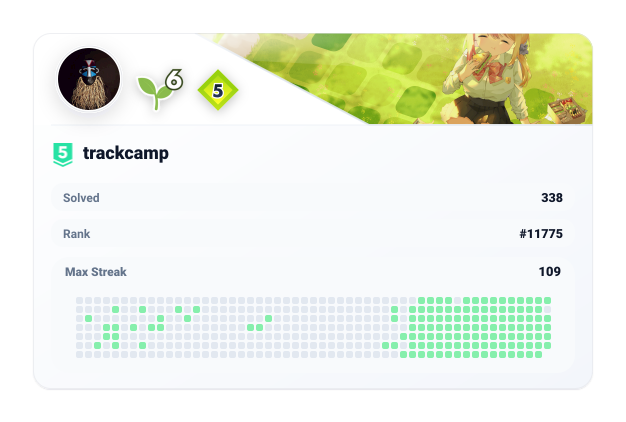

  <pre>
     _   _    _   _  ____       _ _   _ _   _   _   ___        ___    _   _ 
    | | / \  | \ | |/ ___|     | | | | | \ | | | | | \ \      / / \  | \ | |
 _  | |/ _ \ |  \| | |  _   _  | | | | |  \| | | |_| |\ \ /\ / / _ \ |  \| |
| |_| / ___ \| |\  | |_| | | |_| | |_| | |\  | |  _  | \ V  V / ___ \| |\  |
 \___/_/   \_\_| \_|\____|  \___/ \___/|_| \_| |_| |_|  \_/\_/_/   \_\_| \_|
  </pre>

  

 

## Projects

### Finch

`2026.08 ~ 2026.09` 팀 5인, 팀장, 인프라

> 실시간 시세로 국내 주식을 모의 매매하고, AI가 계좌와 시장 데이터를 근거로 설명하는 모의투자 서비스

- 인프라와 운영 환경을 주도해 Docker Compose 구성을 k3s로 이관하고 Helm 차트로 배포
- Ingress와 TLS 이관, Prometheus와 Loki, Grafana 관측 스택 이식, CI 설정 검증
- 로그 로테이션, 컨테이너 메모리 상한, 이미지 정리, 헬스체크, 내부 AI 서비스 노출 차단
- 배포 파이프라인에 healthy 대기와 스모크 테스트 추가

      

[Infra Repo](https://github.com/Team-FINCH/finch-infra) / [Team](https://github.com/Team-FINCH) / [문서와 설계](https://github.com/Team-FINCH/finch-docs)

도메인 로직과 프론트엔드, AI 기능은 다른 팀원이 담당했습니다.

---

### 이음길

`2026.07 ~ 2026.08` 팀 6인, 백엔드

> 여행 일정을 조각으로 이어 붙이며 팀이 하나의 보드에서 함께 계획을 완성하는 실시간 협업 플랫폼

- 서버 쪽 실시간 동기화 코어: op 브로드캐스트 파이프라인과 번호 구간 재요청으로 유실 복구
- 같은 블록을 여럿이 동시에 고칠 때 생기는 유실을 필드 단위 LWW와 블록 행 잠금으로 해결
- 락 획득 순서를 한 방향으로 통일해 교착 경로 차단
- 그룹, 프로젝트, 회원 도메인 API. 그룹 목록 조회는 그룹 수와 무관하게 쿼리 3회로 고정

     

[Repo](https://github.com/prgmd/ieumgil) / [발표 자료](https://drive.google.com/file/d/1vA0zFCZVCyGRHxmshQmdplJXF4VZhfX2/view?usp=sharing)

---

### beautalk

`2026.05 ~ 2026.06` 팀 2인, 백엔드와 인프라

> 피부 프로필을 기반으로 화장품을 추천하는 하이브리드 RAG 챗봇 서비스

- 상품 306종 수집과 정제, 상품명 규칙으로 제형 값 채우기
- 가격과 제형은 SQL로 거르고, 그 후보 안에서 pgvector로 순위를 매기는 추천 구조
- 구간별 계측으로 병목을 찾아 LLM 호출 24초를 3.6초로 단축
- Docker와 Nginx로 AWS EC2에 배포

     

[Repo](https://github.com/prgmd/beautalk) / [발표 자료](https://drive.google.com/file/d/1HtXHQ51Gx0hAQJea4NhGExRa2KNZrCsh/view)

---

### digem

`2025.08 ~` 개인 프로젝트

> 해외 음악 웹진의 칼럼을 자동 수집하고 AI로 번역해 아카이빙하는 ETL 서비스

- GitHub Actions와 Airflow로 수집, 번역, 적재를 매일 자동 실행
- 매체마다 다른 스크래퍼를 공통 흐름으로 구조화
- 번역 실패를 유형별로 기록해 재시도, 대기, 분할, 사람 확인으로 나누고 테스트로 고정
- SQL 쿼리 최적화와 본문 지연 로드

     

[Site](https://www.dig-em.com/) / [Repo](https://github.com/prgmd/digem) &nbsp; `PW: digem123!`

---

### NEVES

`2025.08 ~ 2025.11` 팀 6인, 백엔드

> 대용량 블랙박스 영상을 클라우드에 실시간으로 적재하고 재생하는 MSA 서비스

- 회원가입과 이메일 인증 플로우: 인증 코드 발급, 만료, 즉시 무효화
- 메일 발송 서비스 연동, 발송 실패와 연결 실패 구분
- 템플릿 팩토리로 메일 종류 확장

   

[Repo](https://github.com/LuckyThreeSeven/WebApp) / [발표 자료](https://drive.google.com/file/d/1A-0m88RqwNocBRPxg8aXCVVHwPpvE6UF/view)

스트리밍 파이프라인과 인프라(Terraform, Kubernetes)는 다른 팀원이 담당했습니다.

 

## Algorithm

